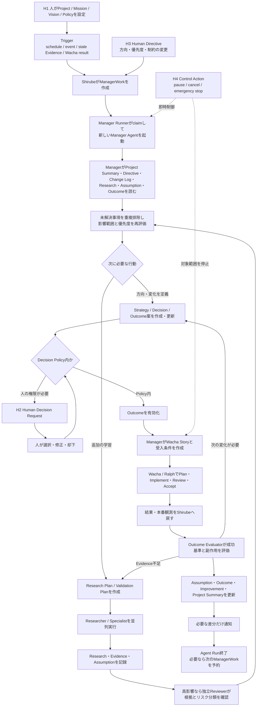

# Shirube プロダクト方向性

- 状態: 検討中・継続更新
- 最終更新: 2026-09-04
- 対象: Shirubeの目的、概念モデル、自律運用、人とエージェントの責務

## この文書の位置づけ

この文書は、設計検討の会話で出た仮案、評価、合意事項、未決事項を日本語で残すための記録である。方向性が固まるたびに更新し、提案を自動的に決定事項として扱わない。

実装詳細は `docs/initial-design.md` で扱う。両者が矛盾する場合は、本書のうち明示的に合意された新しい方向性を優先し、実装前に他の文書へ反映する。

本文では必要に応じて次の状態を使う。

- **合意済み**: 会話で明示的に採用した方向性。
- **有力案**: 現時点で妥当と考えるが、設計決定前の案。
- **仮説**: 検証や追加検討が必要な考え。ドメイン上の正式名称`Assumption`とは区別する。
- **未決**: 選択肢や影響を整理してから決める事項。

ユーザーから示された考えも、明示的に確定されるまでは案として扱う。エージェントは迎合せず、責務の混同、制御不能、安全性低下、追跡不能、Lv6の目標からの逸脱がある場合は作業を止めて指摘し、代案を提示する。

会話ログは検討過程を知るための入力にはなるが、それ自体を唯一の正本にはしない。結論、理由、代替案、未決事項を本書およびShirubeのArtifactとして残す。

## 目標

Ralph LoopでいうLevel 6「AIネイティブ開発システム」を目指す。

個別Taskの実装自動化だけでなく、次のライフサイクル全体をエージェント向けに設計する。

```text
Mission / Vision
  -> 継続的なResearch / Evidence収集
  -> Assumptionの抽出・優先順位付け・検証
  -> Strategy / Decision
  -> Outcome
  -> Wacha Story / Task
  -> 実装・検証・レビュー・リリース
  -> 監視・Outcome評価
  -> 学習・再計画
```

**合意済み:** 基本原則は「エージェントが基本的に動き、人は必要なときに方向と権限を調整する」である。人の常時承認を前提にしない。

「動き続ける」は無制限な常時実行を意味しない。イベント、スケジュール、Evidenceの鮮度、予算、WIP上限、停止条件により制御された自律実行を意味する。

## システム境界

```text
Shirube          WHY / WHAT / LEARNINGを保持し、自律ループを起動・統制する
Wacha            Story / Task / Claim / Review / Acceptanceを管理する
Ralph            Worker / Reviewer等の反復実行を担う
agent-foundation 再利用可能なProfile / Instruction / Skill / Policyを提供する
Product repo     実装成果物を保持する
```

ShirubeはWachaのDBへ直接書き込まず、APIまたはMCPで連携する。

## 意図と実行の構造

```text
Mission -> Vision -> Strategy -> Outcome -> Story -> Task
   WHY       WHERE      CHOICE      CHANGE    VALUE    WORK
```

- Mission: Projectが存在する長期的な理由。変更はまれにする。
- Vision: 実現したい将来状態。エージェントは調査、草案、改定を提案できる。
- Strategy: VisionからOutcomeへ進むための一貫した選択、集中領域、トレードオフ、非目標。
- Outcome: Visionへ近づいたと確認できる、観測・評価可能な現実の変化。
- Story: Outcomeへ寄与する、独立して受け入れ可能な価値の単位。Wachaが所有する。
- Task: Storyを実現する具体的な作業。Wachaが所有する。

Strategyを独立Artifactとするか、複数Decisionの明示的なまとまりとするかは未決である。

**有力案:** MissionとVisionの有効化は人が行う。ただし、人が常にゼロから文章を作る必要はなく、エージェントがEvidence付きの草案を提示してもよい。

## 継続的なResearch

ResearchはMission作成後だけに行う工程ではない。Project作成直後から、すべてのフェーズで必要に応じて行う。

エージェントは次の契機でResearchを開始・更新する。

- 定期スケジュール
- Evidenceの鮮度切れ
- 市場、競合、規制、技術、利用状況の変化
- 新しいMission、Vision、Strategy、Outcome
- Assumptionの高リスク化
- Wachaでの実行結果や本番観測
- 人からの情報・方向修正

「すべてを常時調査する」は実行可能な方針ではない。各Projectに頻度、対象範囲、予算、鮮度、停止条件を設定する。

## Assumption

未検証だが、現在は正しいものとして判断に利用している前提を `Assumption` と呼ぶ。`Hypothesis`は同義語として使わない。

**有力案:** Assumptionは独立Artifactとして扱い、Research、Evidence、Strategy、Decision、Outcome、Storyとの依存関係を追跡する。

### 検証ループ

```text
Research / 観測 / 人からの入力
  -> Assumptionを抽出または更新
  -> 重複排除
  -> 依存Artifactをリンク
  -> リスクと優先順位を評価
  -> 最小限で信頼できる検証を設計
  -> Research / 実験 / 実装を実行
  -> Evidenceを記録
  -> supported / refuted / inconclusiveを評価
  -> 依存Artifactへ影響を伝播
  -> 必要なら再検証を予約
```

`validated`ではなく`supported`を用いる。市場や環境は変化するため、検証済みでも永久に真とは限らない。

```text
identified
  -> prioritized
  -> testing
  -> supported / refuted / inconclusive
  -> stale / superseded
```

Assumptionが`refuted`または`stale`になった場合、依存するStrategy、Decision、Outcome、Storyを自動的に要確認状態にする。過去の結論は削除・黙示的更新をせず、履歴を残す。

### 優先順位

リスク評価は次の3軸を基本とする。

1. Impact if wrong: 誤りだった場合の影響。Project存続に関わる場合は`existential`とする。
2. Uncertainty: Evidenceの不足、古さ、間接性、矛盾の大きさ。
3. Decision proximity: そのAssumptionに依存する高コスト・不可逆な判断がどれだけ目前か。

Validation effortはリスクそのものではなく、同程度のリスクを並べ替える補助要素とする。

2x2表示を使う場合は、縦軸をImpact、横軸をUncertainty、円の大きさまたは色をDecision proximityとする。Validation effortはラベル等で補足する。

## AssumptionとOutcomeを混同しない

Assumptionを検証するたびにOutcomeを作るわけではない。

- 知ることが目的: Research Requestまたは検証実験を作る。
- 現実の状態を変えることが目的: Outcomeを作る。
- 検証または価値提供に実装が必要: Wacha Storyを作る。

Outcomeを単なる調査項目や実装物にしない。Outcomeは「何を作ったか」ではなく、「誰・何にどのような変化が起き、どう判定するか」を表す。

## 自律運用と人の介入

### 基本方針（有力案）

- エージェントはResearch、Assumption管理、優先順位付け、低リスク検証、Outcome草案、Wacha連携、Outcome評価を自動で進める。
- 低リスク、可逆、低コスト、Policy内のOutcomeはエージェントが自動的に有効化できる候補とする。
- 人は毎回のAssumptionやOutcomeを選択・承認しない。
- 人はMission、Vision、リスク許容度、予算、権限境界を定め、例外時に介入する。
- 人待ちは依存する枝だけを止め、無関係なResearchや実行を止めない。

### 人からエージェントへの介入経路

**有力案:** 人の介入は大きく2種類に分ける。ただし正式なArtifact名と状態遷移は未決である。

#### 1. Human Directive（仮称）: 次の動きへ反映する方向修正

エージェントが次の判断時に必ず気付ける、永続的な入力として記録する。

```text
Human Directive
  projectId
  scopeRef?
  type: vision_revision | strategy_guidance | priority_override | constraint | policy_change
  statement
  rationale?
  effectiveAt
  expiresAt?
  createdBy
```

すべてをVision変更として扱わない。

- 将来状態そのものを変える: Visionの追加・改定
- 集中領域や進み方を変える: Strategy GuidanceまたはDecision
- 一時的に優先順位を変える: Priority Override
- 守るべき条件を追加する: ConstraintまたはPolicy Change

Human Directiveを記録したらChange Logへイベントを追加し、影響するProjectのManagerWorkを作成する。次のManager Agentは必ずDirectiveと影響範囲を読み、Assumption、Strategy、Outcome、Wacha workを再評価する。

#### 2. Control Action（仮称）: 直ちに止める・制限する操作

```text
Control Action
  type: pause | resume | cancel | emergency_stop | disable_external_write
  scope: project | outcome | external_work | agent_run
  reason
  createdBy
  createdAt
```

Control Actionは通常の方向提案ではなく即時の運用命令である。監査可能にし、Project全体ではなく可能な限り対象範囲だけを止める。Wacha側の作業停止が必要な場合はWacha API/MCPを通す。

### 人が承認する対象

**有力案:** 原則として次の場合だけ人へエスカレーションする。

- Missionまたは有効なVisionの変更
- Strategyの作成または重大変更
- Project存続に関わるAssumption
- 高コスト、不可逆、規制・法務・セキュリティ上重要なOutcome
- 外部契約、課金、公開、破壊的操作
- Policyや重要なOutcome同士の矛盾
- 主観的・戦略的・高影響な最終評価

Human Decision Requestには、問いだけでなく推奨案、選択肢、Evidence、Assumption、トレードオフ、回答期限を含める。

### 自律化で避ける設計（合意済み）

次の設計はLevel 6を目指す場合でも採用しない。

- 終了条件、予算、WIP上限なしにエージェントを常時実行する。
- 同じAgent Runが高影響Assumptionの作成、採点、検証、最終承認をすべて自己完結する。
- エージェントによる「低リスク」という自己判定だけで外部公開、課金、契約、権限変更、破壊的操作を許可する。
- 人の応答待ちを理由にProject全体を停止する。
- Research件数やStory完了数をOutcome達成とみなす。
- Slackや会話履歴だけを正本にする。

高影響Assumptionと高影響Outcomeには、生成担当とは別のReviewerまたはEvaluatorを割り当てる。不可逆な外部操作はPolicyで明示的に許可されない限り拒否する。自律性は無制限な権限ではなく、明確な境界内で人を待たずに進められる能力として設計する。

## Shirubeにおけるエージェントフロー

「エージェントが動き続ける」は、1つの長寿命Agentが会話履歴を抱えて無期限に動くことではない。Shirubeがイベント、スケジュール、鮮度、外部結果からManagerWorkを作り、毎回新しいAgent Runが永続Artifactを読んで仕事をし、結果を外部化して終了することで継続性を作る。



### フローの責務

| 段階 | 主担当 | 責務 | 永続する出力 |
| --- | --- | --- | --- |
| Trigger判定 | Shirube | スケジュール、鮮度切れ、変更、外部結果から必要なWorkを作る | ManagerWork、Change Log |
| 状況統合 | Manager | 最新状態を読み、重複を除き、次に解くべき問いを選ぶ | 更新された優先順位、Research/Validation Plan |
| 調査・検証 | Researcher / Specialist | 市場、競合、利用者、技術、コード、セキュリティ等を調査する | Research、Evidence、Assumption候補、限界 |
| リスクReview | 独立Reviewer | 高影響な根拠、Assumption、リスク分類の妥当性を確認する | Review結果、異論、再調査要求 |
| 方針・変化の設計 | Manager | EvidenceからStrategy、Decision、Outcome案を統合する | Strategy/Decision、Outcome草案、評価計画 |
| 権限判定 | Shirube Policy | 自動実行可能か、人の判断が必要かを機械的に判定する | Policy判定、Human Decision Request |
| 実行への変換 | Manager | active Outcomeを価値単位と受入条件へ変換する | Wacha Story、ExternalExecutionLink |
| 作業実行 | Wacha / Ralph | Plan、Task分解、実装、検証、Review、Acceptanceを行う | Task、PR、Review、Acceptance、実行結果 |
| Outcome評価 | Outcome Evaluator | 成功基準、現実の指標、副作用を確認する | Outcome Evaluation、Evidence |
| 学習・再計画 | Manager / Improvement Analyst | 依存ArtifactとSummaryを更新し、次のWorkを予約する | Assumption更新、Improvement、Project Summary |
| 通知 | Notification Adapter | 重要な差分と人の要対応だけを配信する | 配信記録、Slack通知 |

Managerは全工程を自分で実行する万能Agentではなく、Project状態を統合し、専門Agentへ委譲し、結果を次の行動へ変換するCoordinatorである。

### 並列実行と終了条件

- Projectが異なればManagerWorkを並列実行できる。
- 同一Projectでも依存関係がなく、予算・WIP上限内ならResearchを並列実行できる。
- 同じManagerWork、同じAssumption検証、同じ外部副作用はidempotency keyで重複実行を防ぐ。
- 各Agent Runは、成果を永続化し、次のWorkまたは停止理由を記録して終了する。
- 次のWorkがない、予算上限、Policy違反、Control Action、依存するHuman Decision待ちのいずれかで該当ブランチを停止する。

## 人間の介入可能箇所

人との接点は4つある。運用開始後に人から始める介入は、当初の整理どおりH3「方向修正」とH4「即時制御」の2種類である。H1は初期設定・基本方針の変更、H2はエージェント側から求める例外的な判断として分ける。

| ID | 経路 | いつ使うか | 人が行うこと | エージェント側の反応 |
| --- | --- | --- | --- | --- |
| H1 | Intent / Policy設定 | Project開始時、目的や権限境界を変えるとき | Mission、Vision、制約、予算、リスク許容度、通知方針を設定 | 全体を再評価し、必要なResearchとAssumptionを作る |
| H2 | Human Decision Request | Policy外、高影響、不可逆、外部責任を伴う判断が必要なとき | 推奨案とEvidenceを見て選択・修正・却下 | 回答に依存する枝だけを再開し、他の枝は継続する |
| H3 | Human Directive（仮称） | エージェントの次の判断へ方向、優先度、制約を反映したいとき | Vision改定、Strategy Guidance、Priority Override、Constraint、Policy Changeを入力 | Change LogとManagerWorkを通じて必ず検知し、影響範囲を再評価する |
| H4 | Control Action（仮称） | 直ちに停止・制限・取消が必要なとき | Project、Outcome、外部Work、Agent Runをpause/cancelし、外部書込みを止める | 新規claimを止め、実行中処理へ取消を伝え、Wacha側もAPI/MCPで停止する |

人は読み取りと観測は常時できるが、通常フローを進めるための承認者にはしない。介入後は「誰が、何を、なぜ、どの範囲へ、いつまで変更したか」を必ず記録する。

### どのArtifactを変更するか

人が方向を変えたい場合、内容に応じて変更先を分ける。

| 変更したい内容 | 変更先 |
| --- | --- |
| Projectが存在する理由 | Mission改定またはsupersede |
| 実現したい将来状態 | Vision追加・改定 |
| 集中領域、勝ち筋、やらないこと | Strategy Guidance / Decision |
| 一時的な順番 | Priority Override |
| 必ず守る条件 | Constraint / Policy Change |
| 特定の変化を起こす・止める | Outcome作成・変更・停止 |
| 緊急に実行を止める | Control Action |

Visionは将来状態が変わった場合にだけ更新する。単なる優先順位変更や一時的な指示でVisionを更新すると、長期方向と運用指示が混ざるため避ける。

## エージェントの役割

```text
Manager Agent
  -> Project全体の状況を統合
  -> Assumptionの重複排除・優先順位付け
  -> SpecialistへResearchを委譲
  -> Strategy / Decision / Outcomeを提案
  -> Policy内でOutcomeを有効化
  -> WachaへStoryを作成
  -> 結果をOutcomeへ戻して評価

Researcher / Specialist
  -> 市場、競合、利用者、技術、コード、セキュリティ等を調査
  -> Evidence、制約、限界、Assumption候補を返す

Outcome Evaluator
  -> Wacha結果と現実の指標を照合
  -> achieved / not achieved / inconclusiveを提案
```

Manager Agentは統合・判断・委譲を担う。すべての調査を自分だけで実行しない。

## Manager Runner

Manager Runnerは判断を行わない薄いランチャーとする。

```text
Manager Runner
  -> ManagerWorkをclaim
  -> Foundation / Profileを固定
  -> Shirube MCPとWacha MCPの接続・権限を渡す
  -> 新しいManager Agentプロセスを1つ起動
  -> leaseを更新
  -> AgentRunを記録
  -> ManagerWorkを完了
```

ShirubeとWachaの両方へアクセスするのは、原則として起動されたManager Agentである。Runner自身へOutcome判断やWacha Story生成を実装しない。

## Summary、詳細、通知

詳細Artifactを正本とし、人が状況を把握するための版管理されたProject Summaryを生成する。

```text
Project Summary
  Mission / Vision
  現在のStrategy
  前回からの重要な変化
  高優先度Assumption
  最近のResearchと確信度・限界
  active Outcomeと進捗
  人の判断が必要な事項
```

Summaryの各記述からResearch、Evidence、Assumption、Decisionへ遡れるようにする。Summary更新で過去の版を失わない。

Slackは正本ではなく通知・議論の投影先とする。次の場合に通知する。

- 重要なResearch結果が追加された
- 高優先度Assumptionの評価が変わった
- OutcomeやStrategyへの影響が発生した
- 人の判断が必要になった
- 定期ダイジェストの時刻になった

1調査ごとの無条件投稿は通知過多になり得る。Projectごとに重要度閾値と通知頻度を設定する。Slack投稿と再送・重複防止はManager Runnerではなく、idempotentなNotification Adapterが担う。

## 会話ログ

ChatGPT等の会話ログは、Research、Evidence、Decision、Assumption候補を抽出する入力として利用できる。ただし、会話ログ自体を最終的な状態管理や判断の唯一の正本にはしない。

取り込む場合は、取得元、参加者、取得日時、アクセス区分、改変されないSnapshotまたはLocatorを記録する。既存のChatGPT会話履歴をAPIで任意取得できることは前提にせず、明示的なインポート、エクスポート、または対応Adapterを利用する。

## 現時点の未決事項

- Strategyを独立Artifactにするか、Decision群として表現するか
- Human DirectiveとControl Actionの正式な名前・状態遷移
- Assumption優先順位の具体的な比較規則
- Outcomeを自動有効化できるDecision Policyの既定値
- 定期Researchの頻度、予算、鮮度の既定値
- ChatGPT会話ログを取り込む具体的な方法
- Slack通知Adapterの認証・チャンネル・再送方式
- Manager / Researcher / Outcome EvaluatorのProfileとInstruction

## 合意履歴

### 2026-09-04

- Level 6を目標とし、エージェントが基本的に動き続ける運用を採用する。
- 高リスク以外はエージェントだけで対処する。
- 人はMissionとVisionを与え、必要時に方向を修正する案を検討する。
- 人の介入を、次回以降へ反映する方向修正と、即時停止・制限に大別する案を検討する。
- 方向修正をすべてVision更新として扱わず、Human Directiveとして意味を分ける案を提示した。名称とモデルは未決である。
- 方向性が固まるたびに本書を日本語で更新する。
- ユーザーの案も自動的に決定事項とせず、筋が悪い場合は即時に指摘して代案を出す。
- 「自律化で避ける設計」に記載した制約へ合意した。
- 通常のAgentフローと、人の介入経路H1〜H4を整理した。Human DirectiveとControl Actionの名称は未決である。

### 2026-09-03

- 基本構造をMission -> Vision -> Outcome -> Story -> Taskとした。
- Missionは長期的目的、Visionは将来状態、Outcomeは観測可能な変化とした。
- Research、Evidence、Decision、Assumptionは階層を横断する根拠とした。
- Assumptionを正式用語とし、リスクベースで継続的に検証する方針とした。
- Summaryと詳細Artifactを分け、Slackは通知先として扱う方針とした。
